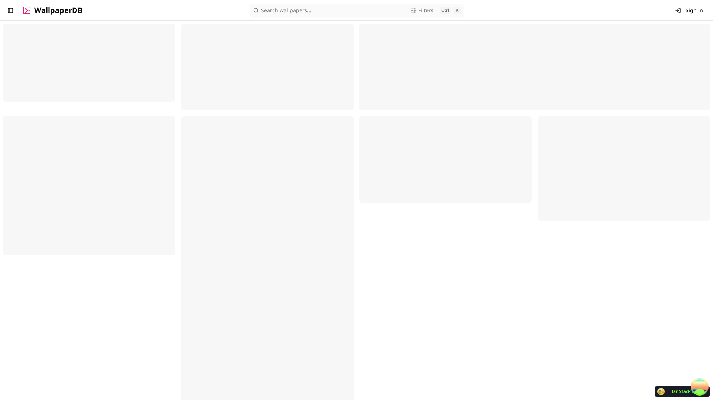

# WallpaperDB

WallpaperDB lets people upload, discover, and download wallpapers, with contributor Profiles and images sized for different devices.

## Start here

- [Run and contribute to the project](CONTRIBUTING.md).
- [Understand domain ownership and service relationships](CONTEXT-MAP.md).
- [Read the coding guidelines](CODING_STANDARDS.md) or [agent workflow rules](AGENTS.md).
- [Read user guides, recovery procedures, and architecture decisions](apps/docs/content/docs/index.mdx).

Workspace READMEs explain their purpose, core capabilities, and relevant technology choices. Use the source, tests, schemas, and `make help` for implementation and command details.

## What belongs in the docs

Keep decisions and their reasons, domain language, contributor setup, user guidance, and operational procedures that are difficult to infer safely from code. Give each topic one home and link to it. Keep ADRs as historical records.

Do not copy file trees, API signatures, configuration defaults, test inventories, or implementation walkthroughs into prose. Track new work in GitHub issues; remove completed plans once their lasting decisions have a home.
