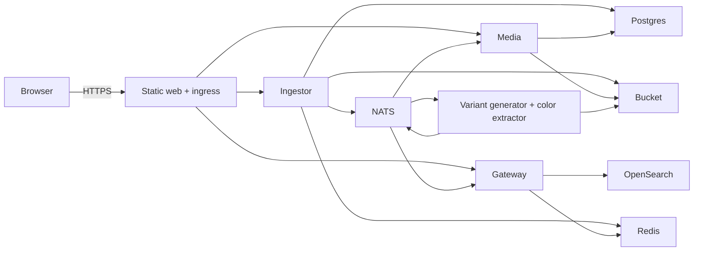

# Hosting WallpaperDB on Railway

Research snapshot: 2026-09-26. Repository baseline: `f4c91614`.

Status: source research and repository inspection only. No Railway resources were
created, containers deployed, production migrations run, or load tests performed.
The deployment design below is a recommendation; platform behavior is linked to
official documentation and application behavior to the current source.

## Feasibility and proposed deployment

WallpaperDB fits Railway's model of separate long-running services, but it needs
deployment preparation before it is ready to host. The main gaps are a production
frontend/ingress image, a migration runner, storage compatibility configuration,
and validation of the stateful services. Railway does not execute Docker Compose
as an orchestrator: its Compose importer translates services into Railway
resources, with incomplete Compose support and no equivalent to `depends_on`.
Applications need startup retries or an explicit initial deployment order.
[Compose deployment guide](https://docs.railway.com/guides/docker-compose).

**Recommendation:** create one project with separate staging and production
environments. Begin with one replica per service and one region. Serve the built
web app and API paths from one public ingress; keep backends, databases, NATS,
Redis and search private. This matches the frontend's relative API URLs and avoids
changing the current production CORS behavior.
[Web GraphQL client](../apps/web/src/lib/graphql/client.ts),
[upload client](../apps/web/src/lib/api/ingestor.ts),
[gateway CORS configuration](../apps/gateway/src/app.ts).

| Railway service/resource | Purpose | Initial persistence/exposure |
| --- | --- | --- |
| `web` / production ingress | Static Vite build, SPA fallback, API proxy | Public HTTPS; no application volume |
| `ingestor` | Authenticated uploads and reconciliation | Private; PostgreSQL, bucket, NATS, Redis |
| `media` | Serve originals and variants | Private; PostgreSQL, bucket, NATS |
| `gateway` | GraphQL search and event projection | Private; OpenSearch, NATS, Redis |
| `variant-generator` | Produce image variants | Private worker with HTTP health endpoint; bucket, NATS |
| `color-extractor` | Extract searchable image colors | Private worker with HTTP health endpoint; bucket, NATS |
| `postgres` | Separate service-owned databases | Persistent volume; private |
| `nats` | JetStream event transport | Volume at `/data`; private `4222`, monitor `8222` |
| `redis` | Rate-limit state | Private; enable persistence if loss of counters is unacceptable |
| `opensearch` | Search read model | Volume at `/usr/share/opensearch/data`; private `9200` |
| Railway Bucket, or external S3-compatible bucket | Originals and generated variants | Durable object storage |
| Optional `tags`, `user` | Current scaffold services | Private; their own databases and NATS |

The functional backend Dockerfiles are under `apps/<service>/Dockerfile`.
`tags` and `user` currently provide scaffold/health functionality; hosting them
reproduces the local service layout but does not add completed tagging/profile
features. The local observability/admin applications and docs website are
separate optional deployments, not prerequisites for the wallpaper flow.
[Application Compose configuration](../infra/docker-compose.apps.yml),
[infrastructure Compose configuration](../infra/docker-compose.yml).



## 1. Prepare production builds

Keep the Railway service Root Directory at the repository root. This is a shared
pnpm/Turborepo workspace: each backend Dockerfile copies the repository and runs
`turbo prune`. Setting the root to `apps/ingestor`, for example, removes access to
root manifests and shared packages. Select each Dockerfile explicitly with
`RAILWAY_DOCKERFILE_PATH=apps/ingestor/Dockerfile` or `build.dockerfilePath` in a
service-specific Railway config file. Retain the image's existing Node start
command. [Example existing image](../apps/ingestor/Dockerfile),
[Railway monorepos](https://docs.railway.com/deployments/monorepo),
[Dockerfile paths and build variables](https://docs.railway.com/builds/dockerfiles).

Add a production frontend image that builds `@wallpaperdb/web` and serves its
`apps/web/dist` output with an SPA fallback. From the repository root, install
with pnpm 10.18.3 and run `pnpm --filter @wallpaperdb/web build`. The current web
Dockerfile is for development; Vite preview is not a production server. A Caddy
runtime can listen on `:{$PORT:3000}` with Railway handling public TLS.
Declare the required `VITE_*` variables as Docker build arguments in the build
stage. Configure watch paths for the service directory, its shared dependencies,
`pnpm-lock.yaml`, `pnpm-workspace.yaml`, root `package.json`, and `turbo.json`.
Watching only the app directory would miss shared-package changes.
[Web package](../apps/web/package.json), [web development image](../apps/web/Dockerfile.dev),
[Vite production deployment](https://vite.dev/guide/static-deploy),
[Railway React/Caddy guide](https://docs.railway.com/guides/react),
[Railway monorepo watch paths](https://docs.railway.com/deployments/monorepo).

Proposed per-backend configuration, to add during implementation:

```json
{
  "$schema": "https://railway.com/railway.schema.json",
  "build": {
    "builder": "DOCKERFILE",
    "dockerfilePath": "apps/ingestor/Dockerfile",
    "watchPatterns": ["apps/ingestor/**", "packages/**", "pnpm-lock.yaml", "pnpm-workspace.yaml", "package.json", "turbo.json"]
  },
  "deploy": {
    "healthcheckPath": "/ready",
    "healthcheckTimeout": 300,
    "restartPolicyType": "ON_FAILURE",
    "restartPolicyMaxRetries": 10
  }
}
```

Set each service's config-file path explicitly if configs live under `apps/`;
that setting is independent of Root Directory. Add a pre-deploy command only
after the final image includes an executable migration runner and migrations.
[Config-as-code reference](https://docs.railway.com/config-as-code/reference).

## 2. Provision durable dependencies

### PostgreSQL and migrations

Create PostgreSQL with a persistent volume. Match the currently used PostgreSQL
16 major version initially, then plan upgrades separately. Preserve the separate
`wallpaperdb_ingestor` and `wallpaperdb_media` databases; create
`wallpaperdb_tags` and `wallpaperdb_user` only if deploying those optional shells.
A single instance with separate databases is the lowest-overhead starting point;
separate instances offer stronger isolation at a higher baseline cost.
Do not point ingestor and media at one database: they define incompatible
`wallpapers` tables. Adapt the initialization SQL's hardcoded `wallpaperdb` role
to the actual Railway database owner. Tags/user currently have empty schemas and
migration journals; there is no missing feature schema to deploy for those shells.
[Current initialization SQL](../infra/postgres/init/01-init.sql),
[ingestor migration](../apps/ingestor/drizzle/0000_left_starjammers.sql),
[media migration](../apps/media/drizzle/0000_mute_the_professor.sql).

Railway's PostgreSQL template supplies connection variables such as `PGHOST`,
`PGPORT`, `PGUSER`, `PGPASSWORD`, and `DATABASE_URL`. It is an unmanaged template:
the application operator remains responsible for maintenance and backups. Use
private database endpoints for application traffic. A stock Railway database
does not automatically execute this repository's Compose-mounted SQL files.
[Railway PostgreSQL documentation](https://docs.railway.com/databases/postgresql).

Provide one migration runner per schema owner, containing the checked-in SQL and
required runtime dependencies. The current backend final images copy built JS
and dependencies, but omit the workspace manifest, Drizzle configuration and SQL
migration folders; simply configuring `pnpm db:migrate` as pre-deploy is not
sufficient. Verify migrations against an empty staging database before promoting
the same artifacts to production.
[Ingestor image](../apps/ingestor/Dockerfile), [media image](../apps/media/Dockerfile).

The existing package command is `drizzle-kit migrate`; make that tooling and
configuration available in a migration image, or package a migration-history-aware
Node runner with the SQL/journals. `RUN_DB_MIGRATE=true` only affects the development
entrypoint. The ingestor's standalone `scripts/migrate.ts` executes the initial SQL
directly and is not an incremental release runner.
[Migration commands](../apps/ingestor/package.json),
[development entrypoint](../scripts/entrypoint.sh),
[one-off ingestor script](../apps/ingestor/scripts/migrate.ts).

Railway pre-deploy commands can reach the private network and receive service
variables. They run in a separate container without mounted volumes; filesystem
writes are discarded. The command must already exist in the built image, and a
nonzero exit blocks deployment. Run database creation/migrations over the network,
not in the Docker build or by writing the database's filesystem. Serialize
migrations per database and use backward-compatible changes because the old app
can still be serving. [Pre-deploy documentation](https://docs.railway.com/deployments/pre-deploy-command).

### NATS JetStream

Deploy a pinned NATS 2 image, enable JetStream, and mount `/data` with the store
directory explicitly set there. The existing Compose arguments are `-js -m 8222
--store_dir=/data`; they are a useful starting point, not a verified Railway
launch command. NATS file storage belongs on the volume, not ephemeral container
storage. [Local NATS configuration](../infra/docker-compose.yml),
[NATS store-directory reference](https://docs.nats.io/reference/config/).

Run an image containing the NATS CLI and
[`setup-streams.sh`](../infra/nats/init/setup-streams.sh) against the running
broker, with `NATS_SERVER=nats://nats.railway.internal:4222`, before enabling event
consumers. The script creates `WALLPAPER` for `wallpaper.>` with file storage and
one-year retention, but unlimited message/byte limits. Choose finite capacity
limits for production and monitor backlog/disk usage. The setup script skips
existing streams, so changing its limits alone will not update an existing stream.

Use `/healthz` on monitoring port `8222` for the Railway HTTP healthcheck, with
`PORT=8222` on the broker service; application clients still connect to `4222`.
Do not publish either port. One broker with a volume persists through redeploys
but is a single point of availability. A real HA design requires separately
configured clustered nodes and replication; adding Railway replicas cannot share
a volume. [NATS monitoring](https://docs.nats.io/learn/monitoring/monitoring-endpoints),
[Railway volume limitations](https://docs.railway.com/volumes/reference).

### Object storage

**Recommendation:** use Railway Buckets if the compatibility checks below pass,
or retain an external S3-compatible provider. Hosting MinIO on Railway is another
option, but adds a stateful service, a volume and its backup/maintenance work.
The current backend already fetches objects and serves them through `media`, so
public bucket access is not required for the proposed topology.
[Media service](../apps/media/src/services/media.service.ts).

Railway Buckets are private-only. Current buckets use virtual-hosted URLs;
older buckets may use path-style URLs, as indicated by their Credentials tab.
Use the supplied bucket name, endpoint, region and credentials verbatim. The
current shared S3 connection defaults `forcePathStyle` to `true`, and application
wrappers use that default. Add a configurable URL-style setting and pass `false`
for a virtual-hosted bucket. Verify `HeadBucket`, uploads, reads, listing and
deletion before selecting the provider. A generic S3 compatibility claim is not
evidence that this application's exact SDK settings work unchanged.
[Railway Buckets](https://docs.railway.com/storage-buckets),
[shared S3 connection](../packages/core/src/connections/minio-connection.ts).

Create the bucket before starting services; they do not provision it. Grant
ingestor upload, object inspection, listing and deletion permissions; variants
need reads/writes, while media and color extraction need reads. All four also
use `HeadBucket` in dependency health checks.
[Ingestor storage](../apps/ingestor/src/services/storage.service.ts),
[orphan cleanup](../apps/ingestor/src/services/reconciliation/orphaned-minio-reconciliation.service.ts),
[shared bucket health check](../packages/core/src/connections/minio-connection.ts).

### Search and Redis

The current application requires OpenSearch; PostgreSQL needs no pgvector extension.
Its mapping uses `index.knn=true`, a 64-dimensional `knn_vector`, Lucene HNSW and
cosine similarity. Keep `OPENSEARCH_INDEX=wallpapers`: the current index definition
hardcodes this name even though the config accepts another. Gateway creates the
index at startup, so its account needs index creation plus document read/write
permissions. [Search mapping](../apps/gateway/src/opensearch/mappings.ts),
[index definition](../apps/gateway/src/opensearch/index-definitions.ts),
[index initialization](../apps/gateway/src/services/index-manager.service.ts).

For a Railway-hosted instance, create a service from a pinned compatible OpenSearch
image and mount `/usr/share/opensearch/data`. Start with `discovery.type=single-node`
and an explicit JVM heap, leaving memory headroom outside the heap. The local
2.11.0 image, 512 MiB heap and disabled security are development settings, not a
production recipe. Select and test a supported image version; OpenSearch 2.12+
requires an initial admin password when installing its demo security configuration.
Configure actual credentials and appropriate TLS trust for gateway instead of
copying the disabled-security configuration.
[Local baseline](../infra/docker-compose.yml),
[OpenSearch Docker guidance](https://docs.opensearch.org/latest/install-and-configure/install-opensearch/docker/),
[gateway connection authentication/TLS](../packages/core/src/connections/opensearch-connection.ts).

Treat OpenSearch startup as an early feasibility check. Official Linux guidance
requires host `vm.max_map_count` of at least 262144; verify Railway's actual
environment and bootstrap behavior rather than assuming host sysctl/ulimit
commands are available. Railway mounts volumes as root, while OpenSearch refuses
to run as root. If needed, use an image entrypoint that fixes data-directory
ownership and then drops privileges. Verify index creation, color queries and
persistence after redeploy. If these checks cannot be satisfied, use a compatible
managed OpenSearch service and configure `OPENSEARCH_URL` and credentials.
[OpenSearch host requirements](https://docs.opensearch.org/latest/install-and-configure/install-opensearch/index/),
[Railway mount permissions](https://docs.railway.com/volumes),
[OpenSearch root-user check](https://github.com/opensearch-project/OpenSearch/blob/main/server/src/main/java/org/opensearch/bootstrap/Bootstrap.java).

Use private Railway Redis with a password and configure `REDIS_HOST`, `REDIS_PORT`
and `REDIS_PASSWORD` separately. The app does not consume `REDIS_URL`, and its
current Redis connection exposes no TLS setting. An external TLS-only Redis
provider therefore needs connection changes.
[Redis configuration](../packages/core/src/connections/redis-connection.ts).

## 3. Configure networking and variables

New Railway environments created after 2025-10-16 have both IPv4 and IPv6 private
DNS records; legacy environments are IPv6-only. Create a new environment for
this deployment and verify connectivity from running containers. Existing Node
services bind `0.0.0.0`; the shared ioredis client does not set a dual-stack lookup
option, which matters on legacy environments. Do not attempt to access
`*.railway.internal` from the browser or during the Docker build.
[Private networking](https://docs.railway.com/networking/private-networking/how-it-works),
[library configuration](https://docs.railway.com/networking/private-networking/library-configuration),
[Redis client](../packages/core/src/connections/redis-connection.ts).

Use `NODE_ENV=production` for every backend. Let applications read Railway's
`PORT`, or explicitly set stable private service ports and use the same values
in ingress/upstream URLs and healthchecks. Public TLS terminates at Railway;
private HTTP is suitable inside its encrypted network. Only ingress needs a
public domain. [Domain configuration](https://docs.railway.com/networking/domains/working-with-domains),
[healthcheck port](https://docs.railway.com/deployments/healthchecks).

Prefer the explicit ports below for the initial setup: some Dockerfiles declare
`EXPOSE 3000` despite different application defaults. Set `PORT` explicitly and
configure ingress's Railway domain to target its actual listening port; do not
rely on those image hints. [Ingestor image](../apps/ingestor/Dockerfile),
[ingestor port/bind](../apps/ingestor/src/index.ts).

The matrix below lists deployment inputs; source defaults for tuning can remain
unchanged initially. `S3_*` means `S3_ENDPOINT`, `S3_ACCESS_KEY_ID`,
`S3_SECRET_ACCESS_KEY`, `S3_BUCKET`, `S3_REGION`. `Redis variables` means
`REDIS_ENABLED=true`, `REDIS_HOST`, `REDIS_PORT`, `REDIS_PASSWORD`.

| Service | Initial explicit port | Required deployment inputs / choices |
| --- | --- | --- |
| `ingestor` | `3001` | Own `DATABASE_URL`; `S3_*`; `NATS_URL`; `NATS_STREAM=WALLPAPER`; Redis variables; production `CLERK_SECRET_KEY`; `CLERK_DOMAIN` for OpenAPI auth metadata |
| `media` | `3003` | Own `DATABASE_URL`; `S3_*`; `NATS_URL`; `NATS_STREAM=WALLPAPER` |
| `gateway` | `3004` | `OPENSEARCH_URL`; `OPENSEARCH_INDEX=wallpapers`; optional `OPENSEARCH_USERNAME`/`OPENSEARCH_PASSWORD` matching provider; `NATS_URL`; `NATS_STREAM=WALLPAPER`; Redis variables; random stable `CURSOR_SECRET` of at least 32 characters; `MEDIA_SERVICE_URL=http://media.railway.internal:3003`; `MEDIA_PUBLIC_BASE_URL=https://<app-domain>/media`; `MEDIA_PUBLIC_PATH=/media` |
| `variant-generator` | `3006` | `S3_*`; `NATS_URL`; `NATS_STREAM=WALLPAPER` |
| `color-extractor` | `3007` | `S3_*`; `NATS_URL`; `NATS_STREAM=WALLPAPER` |
| Optional `tags` | `3008` | Own `DATABASE_URL`; `NATS_URL`; `NATS_STREAM=WALLPAPER` |
| Optional `user` | `3009` | Own `DATABASE_URL`; `NATS_URL`; `NATS_STREAM=WALLPAPER`; optional `CLERK_SECRET_KEY`, `CLERK_PUBLISHABLE_KEY` |
| `web` build | Runtime ingress port, e.g. `3000` | `VITE_CLERK_PUBLISHABLE_KEY`; `VITE_BASE_PATH=/`; `VITE_GATEWAY_URL=/gateway/graphql`; `VITE_INGESTOR_URL=/ingestor`; `VITE_CLERK_IS_SATELLITE=false`; review optional Clerk variables below |
| Every backend, optional | — | `OTEL_EXPORTER_OTLP_ENDPOINT`, `OTEL_SERVICE_NAME`; omit endpoint if no compatible collector is configured |

Sources: service configuration files for
[ingestor](../apps/ingestor/src/config.ts), [media](../apps/media/src/config.ts),
[gateway](../apps/gateway/src/config.ts), [variants](../apps/variant-generator/src/config.ts),
[colors](../apps/color-extractor/src/config.ts), [tags](../apps/tags/src/config.ts),
[user](../apps/user/src/config.ts), and [frontend](../apps/web/src/App.tsx).

Use Railway references instead of copying generated passwords. For example,
`NATS_URL=nats://${{nats.RAILWAY_PRIVATE_DOMAIN}}:4222`,
`REDIS_HOST=${{redis.RAILWAY_PRIVATE_DOMAIN}}`, and
`S3_ENDPOINT=${{wallpapers.ENDPOINT}}`. Bucket credentials are exposed as
`ACCESS_KEY_ID`, `SECRET_ACCESS_KEY`, `BUCKET`, `REGION`, `ENDPOINT`; map these to
the application's `S3_*` names. A shared PostgreSQL instance needs distinct
database names in each service's connection string, not the same default
`DATABASE_URL` everywhere. [Bucket connection example](https://docs.railway.com/guides/storage-buckets-guide).

Review `VITE_CLERK_DOMAIN`, `VITE_CLERK_IS_SATELLITE`,
`VITE_CLERK_SIGN_IN_URL`, `VITE_CLERK_SIGN_UP_URL`, and
`VITE_CLERK_SIGN_IN_FALLBACK_REDIRECT_URL` /
`VITE_CLERK_SIGN_UP_FALLBACK_REDIRECT_URL` for the production Clerk setup.
They are optional and should not inherit local/satellite values accidentally.
Keep secret keys in backend runtime variables; frontend `VITE_*` values are
public build configuration. Configure the final domain in Clerk and test the
real sign-in, sign-up and callback routes. [Current Clerk provider](../apps/web/src/App.tsx).

For production Clerk, choose a domain you own, connect its app hostname to Railway,
create a Clerk production instance, and add Clerk's DNS records and certificates.
Use its `pk_live_...` publishable key for the frontend build and `sk_live_...` secret
at ingestor runtime. Configure production OAuth credentials and application paths;
test `/sign-in`, `/sign-up` and `/sso-callback` through the SPA fallback. A generated
Railway domain can serve an initial smoke test with a development Clerk instance,
but does not replace Clerk's owned-domain production setup. Despite its README,
the current user service has no webhook receiver to configure.
[Clerk production setup](https://clerk.com/docs/guides/development/deployment/production),
[current user routes](../apps/user/src/routes/index.ts).

Vite replaces these environment values at build time, so changing Railway runtime
variables alone does not update an existing frontend bundle. Never pass backend
credentials through a `VITE_*` variable.
[Vite environment behavior](https://vite.dev/guide/env-and-mode).

The production ingress should strip `/ingestor`, `/media`, and `/gateway` before
forwarding to the matching private backend, preserving route/query semantics.
Keep optional scaffold services private. Keep the frontend SPA fallback after
API routes. Implement controlled trusted-proxy handling
so gateway `request.ip` reflects the client for rate limits; verify forwarded
headers cannot be spoofed. Do not publish the local admin/debug ingress routes.
[Gateway rate-limit use](../apps/gateway/src/app.ts).

## 4. Deploy, verify and operate

1. Create the new project/environment, set spend alerts and select a region.
2. Provision PostgreSQL, Redis, NATS, object storage and search; verify storage
   permissions and that data survives a redeploy.
3. Create service-owned databases, run migrations, initialize JetStream streams,
   and test S3 operations from a container in that environment.
4. Deploy media, gateway and both workers; confirm their readiness and consumer
   subscriptions before allowing uploads. Deploy ingestor with production auth.
5. Build/deploy the production web/ingress service, attach HTTPS domain and
   finalize Clerk configuration. Rebuild if frontend build variables change.
6. Test sign-in and upload of a representative large image; confirm originals,
   variants, color events, GraphQL search and public media URLs all work. Repeat
   after restarting NATS, an application worker and the database independently.
7. Test migration failure handling, graceful worker shutdown, retry behavior,
   controlled client-IP rate limits, restore procedures, and a full redeploy.

Configure Railway `/ready` deployment checks for backends and separate ongoing
monitoring of `/health`, consumer lag, disk capacity and error rates. `/ready`
only confirms initialization/shutdown state; `/health` probes dependencies.
Neither validates the migrated tables or a completed upload-to-search workflow.
Require the functional checks above even when health endpoints return 200.
[Health implementation](../packages/core/src/health/health-aggregator.ts).

Railway's healthcheck is a deployment gate, not continuous monitoring. Set a measured
`RAILWAY_DEPLOYMENT_DRAINING_SECONDS` so shutdown handlers can finish; the default
is zero. [Healthcheck behavior](https://docs.railway.com/deployments/healthchecks),
[deployment variables](https://docs.railway.com/variables/reference).

Test large uploads over the actual public route: Railway requires the request
body to finish uploading within five minutes. The app accepts JPEG, PNG and WebP
images up to 50 MiB, below its multipart transport limit of 200 MiB. Include image
download through the UI and reloads of deep links, not only an HTTP check of `/`.
[Railway edge limits](https://docs.railway.com/networking/public-networking/specs-and-limits),
[image validation limits](../apps/ingestor/src/services/validation-limits.service.ts),
[upload route](../apps/ingestor/src/routes/upload.routes.ts).

After the first verified staging release, connect each repo-backed service to the
intended Git branch and configure deployment to wait for CI. The current GitHub
workflow builds, lints, type-checks and tests but contains no Railway deployment
step. Reuse those checks and promote tested changes through staging before
production; keep migration and event changes compatible with the previous release.
[Existing CI](../.github/workflows/ci.yml),
[Railway GitHub autodeploys](https://docs.railway.com/deployments/github-autodeploys).

Keep serverless sleeping disabled initially for workers, NATS and databases:
outbound traffic drives Railway's inactivity detection, and persistent
connections/polling can prevent sleep anyway. Measure behavior before enabling
it on ingress. [Serverless behavior](https://docs.railway.com/deployments/serverless).

Plan database and JetStream backups plus an object-storage recovery policy.
Railway volumes allow only one volume per service, do not support replicas, and
introduce downtime during redeployment. Root-owned mounts can require ownership
initialization for non-root images. Test backup restoration, not only creation;
native volume backups restore within the same project/environment and do not
provide coordinated recovery across all stores.
[Volume reference](https://docs.railway.com/volumes/reference),
[volume permissions](https://docs.railway.com/volumes),
[backup behavior](https://docs.railway.com/volumes/backups).

## 5. Cost and capacity considerations

Published rates at research time are $10/GB-month RAM, $20/vCPU-month CPU,
$0.05/GB service egress, and $0.15/GB-month volume storage. Hobby has a $5 monthly
minimum and Pro $20; included usage offsets the subscription rather than adding
the entire subscription on top of usage. Actual usage, not allocated maximums,
determines compute charges. [Railway pricing](https://docs.railway.com/pricing).

Bucket storage is $0.015/GB-month with free S3 operations and bucket egress.
However, buckets use the public network: uploading originals/variants from a
Railway service incurs **service** egress. Serving images through `media` and
ingress also incurs service egress to the browser. Presigned direct downloads
could reduce that path's compute/egress, but would be a future application change.
[Bucket billing](https://docs.railway.com/storage-buckets/billing).

Illustration, **not a measured estimate**: average aggregate usage of 4 GB RAM,
0.5 vCPU, 20 GB volumes, 100 GB objects and 200 GB charged service egress would
cost about `$40 + $10 + $3 + $1.50 + $10 = $64.50/month`, before incremental
backups, external services, and another environment. OpenSearch, always-on
processes and image-serving bandwidth are likely major contributors; measure
them with representative images before sizing production.

Hobby volumes start at 5 GB; Pro starts at 50 GB and can grow to 1 TB. Volume
count limits are 10 per project on Hobby and 20 on Pro (increasable); one shared
PostgreSQL instance reduces count and baseline overhead. Hobby bucket capacity
is 1 TB combined. Do not treat a free trial as a production plan for this stack.
[Volume limits](https://docs.railway.com/volumes/reference),
[bucket plan limits](https://docs.railway.com/storage-buckets/billing).

Set alerts and realistic per-service resource limits after measuring memory
peaks during uploads, resizing and color extraction. A hard workspace spending
limit shuts workloads down when reached; it is a spending cap, not graceful
traffic throttling. [Cost controls](https://docs.railway.com/pricing/cost-control).

## Remaining decisions and deployment proof

- Confirm self-hosted OpenSearch viability, or select a compatible managed host.
- Decide Railway Bucket versus external object storage after the SDK smoke test.
- Decide whether brief single-node database/NATS/search outages are acceptable;
  high availability requires a separate design and budget.
- Choose whether this deployment starts empty or needs existing database,
  object and event/search state transferred with a coordinated cutover.
- Measure expected wallpaper counts, variant expansion, downloads and image
  processing concurrency; this research cannot establish the monthly bill.

This document establishes the work and platform constraints. Production
readiness remains unverified until the proposed images, private networking,
migrations, storage and complete upload-to-search flow pass in staging.
